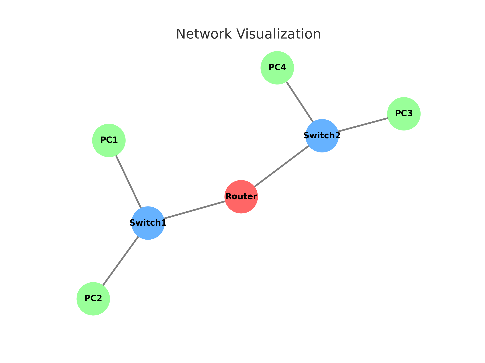

<h1 align="center">Zafer Steele's Python Network Visualisation toolkit</h1>


<p align="center">

</p>

A collection of Python scripts and tools designed for visualizing network data and traffic. This toolkit leverages powerful libraries like **Graphviz**, **Matplotlib**, **Pygal**, and integrates flow-based monitoring utilities such as **ntop** and **sflowtool** to generate insightful and interactive network graphs and visual analytics.


---

## 📂 Repository Structure

```
python-Network-Visualisation/
│
├── flow-based-monitoring/
│   ├── netflow/
│   │   ├── netflow_v5_udp_listener.py
│   │   ├── ansible/                    # Automates router configuration
│   │   └── ntop/                       # Interacts with ntop for interface data
│   └── sflow/
│       └── sflowtool/                  # Filters and processes sFlow data
│
├── graphviz/
│   ├── Ansible/                        # LLDP discovery and network graph generation
│   └── graphviz_manual_operation/     # Static .gv topologies
│
├── matplotlib/                         # Plots traffic metrics using Matplotlib
│
├── pygal/                              # SVG-based protocol traffic visualizations
│
└── pysnmp/                             # SNMP-based data collection and logging
```

---

## 🚀 Features

- **Graphviz Network Graphs**: Automate network topology discovery and visualization using LLDP and Ansible.
- **Matplotlib Plots**: Generate time-series plots and protocol distribution pie charts.
- **Pygal Visuals**: Create interactive and scalable SVG charts for protocol metrics.
- **NetFlow/SFlow Monitoring**: Integrate with tools like `sflowtool` and `ntop` to extract and filter traffic flows.
- **SNMP Polling**: Query router metrics and statuses using PySNMP.

---

## 📦 Dependencies

Key libraries and tools used:

- `graphviz`, `pygraphviz`
- `matplotlib`
- `pygal`
- `pysnmp`
- `ansible`
- `sflowtool`, `ntopng`

Install Python dependencies using:

```bash
pip install -r requirements.txt
```

*Note: Tools like `ntopng` and `sflowtool` may require manual installation depending on your OS.*

For sflowtool and ntopng, on Ubuntu/Debian, install them with:

```bash
sudo apt update
sudo apt install sflowtool ntopng
```

## ⚙️ Usage Examples

### 1. Visualize LLDP-based topology with Graphviz

```bash
cd graphviz/Ansible
ansible-playbook cisco_discover_lldp.yml
python cisco_lldp_graph_builder.py
```

### 2. Generate Traffic Charts with Matplotlib

```bash
cd matplotlib
python plot_router_traffic_all_metrics.py
```

### 3. Create Protocol Pie Chart with Pygal

```bash
cd pygal
python plot_protocol_pie.py
```

### 4. Monitor NetFlow Traffic

```bash
cd flow-based-monitoring/netflow
python netflow_v5_udp_listener.py
```

---

## 🧪 Sample Output

- 📊 `matplotlib/all_router_traffic_metrics.png`
- 🕸️ `graphviz/Ansible/output/lldp_graph.gv.pdf`
- 🧬 `pygal/router1_gig0_traffic.svg`

---

## 🧩 Contributions

Feel free to fork and contribute via pull requests. Whether it's a bug fix, new visualization module, or better automation -your input is welcome!

---

## 👤 Author

**Zafer Steele**
GitHub: [@zaferSteele](https://github.com/zaferSteele)

---

## 📝 License

This repository is licensed under the MIT License. See [LICENSE](LICENSE) for details.

---

